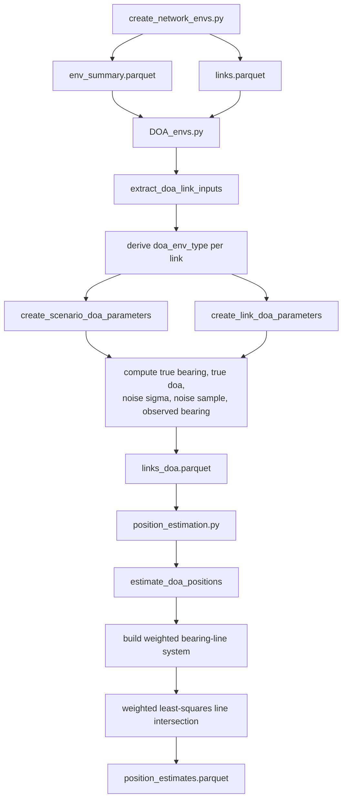

# Data generation

#### Overall specifications & constraints

The main purpose of this document is to define the specification and constraints for the DOA/AOA data generation phase of a ***Machine Learning Device Positioning Prediction Model.***

We are emulating ***2D indoor and outdoor environments*** with multiple devices operating within a ***5 GHz frequency band***.

<br>

### Environment

- **Dimensionality:**  
  The environment is modelled as a two-dimensional Cartesian coordinate space, with positions represented as $(x, y)$ coordinate pairs.

  <br>

- **Restricted domain and range $(x, y)$:**  
  $-100 > x > 100,\ -100 > y > 100$  
  $-400 < x < 400,\ -400 < y < 400$  
  representing an indoor or outdoor environment of minimum **200 m × 200 m = 40,000 m²** and maximum **800 m × 800 m = 640,000 m²**.

  <br>

- **Antenna positioning & density:**  
  Antennas are generated such that complete environment coverage is achieved with the minimum number of devices, ensuring uniform spatial distribution and no coverage gaps.

<br>


## DOA / AOA Data Generation

This folder defines the Direction of Arrival (DOA) / Angle of Arrival (AOA)
measurement-generation stage for the Machine Learning Device Positioning
Prediction Model.

The implemented code does the following:

1. Read the shared scenario tables generated by `create_network_envs.py`.
2. Use the existing antenna-target link geometry from `links.parquet`.
3. Add DOA/AOA-specific measurement columns.
4. Write one output row per antenna-target link to `links_doa.parquet`.

This stage generates geometric DOA/AOA measurements with angular noise. It does
not run a full MUSIC covariance/snapshot simulation for every row.

The later positioning stage is implemented in `position_estimation.py`. For
DOA/AOA, that stage does not use a strict half-ray intersection algorithm.
Instead, it converts each noisy bearing into an infinite 2D line and solves a
weighted least-squares line-intersection problem to estimate the target
position.

The current generated parquet tables are the source of truth for environment
scale and schema.

<br>

### Usage

```bash
python3 "Data Generation/DOA/DOA_envs.py" \
  --data-dir "generated_network_scenarios" \
  --seed 42
```

Default input tables:

- `env_summary.parquet`
- `links.parquet`

Default output table:

- `links_doa.parquet`

Optional output controls:

```bash
python3 "Data Generation/DOA/DOA_envs.py" \
  --data-dir "generated_network_scenarios" \
  --output "generated_network_scenarios/custom_doa.parquet"
```

`--overwrite-links` is available for consistency with the RSSI/TDOA scripts, but
normal usage should keep `links.parquet` unchanged and write `links_doa.parquet`.

<br>

### AOA / DOA Model

AOA estimates the direction from which a signal arrives at a receiver. DOA refers
to the signal-processing estimation process, while AOA is the resulting
geometric angle used for positioning.

For v1 data generation, each antenna-target link is converted into a global
bearing angle:

$$
\theta_{\text{bearing}} = \mathrm{atan2}(y_T - y_i, x_T - x_i)
$$

where:

- `(x_i, y_i)` is the anchor antenna position
- `(x_T, y_T)` is the target position
- `theta_bearing` is the true global direction from anchor to target

The ULA broadside orientation is fixed to global `+x` in v1:

$$
\psi_i = 0
$$

The true DOA relative to the antenna array is:

$$
\theta_{\text{doa}} = \mathrm{wrap}(\theta_{\text{bearing}} - \psi_i)
$$

The observed noisy DOA is:

$$
\theta_{\text{doa}}^{\text{obs}} =
\mathrm{wrap}(\theta_{\text{doa}} + \epsilon_\theta)
$$

The observed global bearing is:

$$
\theta_{\text{bearing}}^{\text{obs}} =
\mathrm{wrap}(\theta_{\text{doa}}^{\text{obs}} + \psi_i)
$$

All angle columns are wrapped to:

- radians: `[-pi, pi)`
- degrees: `[-180, 180)`

With fixed orientation `psi_i = 0`, `observed_doa` and `observed_bearing` are
numerically the same in v1. Both are stored so future per-antenna orientation can
be added without changing downstream semantics.

<br>

### ULA Parameters

Each anchor is treated as a Uniform Linear Array (ULA) receiver.

| Parameter | Default | Notes |
| --- | --- | --- |
| Carrier frequency | `5.5e9 Hz` | Matches the current RSSI default frequency |
| Propagation speed | `299792458.0 m/s` | Speed of RF propagation |
| Wavelength | `c / f` | Computed per run |
| Number of array elements | sampled `5-10` | Sampled once per scenario |
| Element spacing | `lambda / 2` | Constrained to avoid spatial aliasing |
| Array orientation | `0 rad`, `0 deg` | Broadside aligned with global `+x` |

Element spacing must satisfy:

$$
d \leq \frac{\lambda}{2}
$$

At approximately 5 GHz, `lambda / 2` is about 3 cm.

<br>

### Angular Noise Model

Noise is sampled in two stages:

1. `doa_noise_sigma_deg` is sampled once per antenna-target link from the
   sigma range for that link's `doa_env_type`.
2. `doa_noise_deg` / `doa_noise_rad` is sampled independently per link from a
   zero-mean Gaussian distribution.

The DOA environment class combines the scenario environment and link LOS/NLOS
state from `links.parquet`.

| DOA environment type | Default sigma range |
| --- | --- |
| `outdoor_los` | `1.0-3.0 deg` |
| `outdoor_nlos` | `3.0-8.0 deg` |
| `indoor_los` | `2.0-5.0 deg` |
| `indoor_nlos` | `5.0-15.0 deg` |

These defaults can be overridden from the CLI, for example:

```bash
python3 "Data Generation/DOA/DOA_envs.py" \
  --data-dir "generated_network_scenarios" \
  --indoor-nlos-noise-sigma-deg-min 6.0 \
  --indoor-nlos-noise-sigma-deg-max 18.0
```

<br>

### Output Columns

The output table keeps the shared link columns and adds:

| Column | Description |
| --- | --- |
| `doa_env_type` | `outdoor_los`, `outdoor_nlos`, `indoor_los`, or `indoor_nlos` |
| `carrier_frequency_hz` | Carrier frequency used to compute wavelength |
| `propagation_speed_m_per_s` | RF propagation speed |
| `wavelength_m` | `propagation_speed_m_per_s / carrier_frequency_hz` |
| `num_array_elements` | Scenario-level sampled ULA element count |
| `element_spacing_m` | ULA element spacing |
| `array_orientation_rad` / `array_orientation_deg` | Fixed ULA broadside orientation |
| `true_bearing_rad` / `true_bearing_deg` | True global anchor-to-target angle |
| `true_doa_rad` / `true_doa_deg` | True angle relative to array broadside |
| `doa_noise_sigma_rad` / `doa_noise_sigma_deg` | Per-link angular noise standard deviation |
| `doa_noise_rad` / `doa_noise_deg` | Per-link sampled angular noise |
| `observed_doa_rad` / `observed_doa_deg` | Noisy DOA relative to array broadside |
| `observed_bearing_rad` / `observed_bearing_deg` | Noisy global ray angle for later positioning |
| `is_doa_valid` | `False` if target and antenna positions coincide |

If `distance_m <= 1e-9`, DOA is undefined. The row is preserved with
`is_doa_valid = False`, and the angle/noise measurement columns are left null.

<br>

## Full Pipeline: Generation To Position Estimation

The DOA/AOA path in the project has two separate stages:

1. `DOA_envs.py` generates one noisy bearing measurement per antenna-target link
   and writes `links_doa.parquet`.
2. `position_estimation.py` groups those link rows by `(scenario_id, target_id)`
   and estimates one target position per group.

That means:

- `links_doa.parquet` is a measurement table
- `position_estimates.parquet` is an estimation table

### UML Data Flow



### Stage 1: What `DOA_envs.py` Produces

Input:

- `env_summary.parquet`
- `links.parquet`

Output:

- `links_doa.parquet`

Granularity:

- one row per `(scenario_id, target_id, antenna_id)`

The generated DOA row contains:

- anchor geometry: `antenna_x`, `antenna_y`
- target geometry: `target_x`, `target_y`
- derived link class: `doa_env_type`
- scenario-level array parameters:
  `carrier_frequency_hz`, `wavelength_m`, `num_array_elements`,
  `element_spacing_m`, `array_orientation_rad`, `array_orientation_deg`
- link-level measurement quantities:
  `true_bearing_*`, `true_doa_*`, `doa_noise_sigma_*`, `doa_noise_*`,
  `observed_doa_*`, `observed_bearing_*`
- validity flag:
  `is_doa_valid`

### Stage 2: How `position_estimation.py` Uses DOA/AOA

`position_estimation.py` reads `links_doa.parquet` and groups rows by:

- `scenario_id`
- `target_id`

For each group it:

1. reads anchor positions from `antenna_x`, `antenna_y`
2. reads noisy global bearings from `observed_bearing_rad`
3. reads per-link uncertainty from `doa_noise_sigma_rad`
4. converts each bearing into a 2D line constraint
5. solves a weighted least-squares intersection problem
6. writes one estimated target point into `position_estimates.parquet`

## DOA Position Estimation Model

The plotting utility draws rays for visual intuition, but the estimator itself
solves a line-intersection problem. This is an important distinction:

- plotting: finite rays drawn outward from anchors
- estimation: infinite bearing lines solved in weighted least squares

### 1) Bearing line from one anchor

For anchor position

$$
\mathbf{a}_i = (x_i, y_i)
$$

and observed global bearing from the `observed_bearing_rad` column

$$
\theta_i
$$

the direction vector of the bearing line is

$$
\mathbf{d}_i =
\begin{bmatrix}
\cos\theta_i \\
\sin\theta_i
\end{bmatrix}
$$

and the normal vector used by the code is

$$
\mathbf{n}_i =
\begin{bmatrix}
-\sin\theta_i \\
\cos\theta_i
\end{bmatrix}
$$

The estimated target point

$$
\hat{\mathbf{p}} =
\begin{bmatrix}
\hat{x} \\
\hat{y}
\end{bmatrix}
$$

must lie on the line orthogonal to that normal:

$$
\mathbf{n}_i^\top \hat{\mathbf{p}} = \mathbf{n}_i^\top \mathbf{a}_i
$$

### 2) Linear system solved by the code

Stacking one line equation per anchor gives:

$$
A\hat{\mathbf{p}} = \mathbf{b}
$$

where each row of

$$
A
$$

is

$$
\mathbf{n}_i^\top
$$

and each entry of

$$
\mathbf{b}
$$

is

$$
\mathbf{n}_i^\top \mathbf{a}_i
$$

In coordinate form, the code uses:

$$
A =
\begin{bmatrix}
-\sin\theta_1 & \cos\theta_1 \\
-\sin\theta_2 & \cos\theta_2 \\
\vdots & \vdots \\
-\sin\theta_N & \cos\theta_N
\end{bmatrix}
$$

$$
\hat{\mathbf{p}} =
\begin{bmatrix}
\hat{x} \\
\hat{y}
\end{bmatrix}
$$

$$
\mathbf{b} =
\begin{bmatrix}
-\sin\theta_1 \, x_1 + \cos\theta_1 \, y_1 \\
-\sin\theta_2 \, x_2 + \cos\theta_2 \, y_2 \\
\vdots \\
-\sin\theta_N \, x_N + \cos\theta_N \, y_N
\end{bmatrix}
$$

$$
A\hat{\mathbf{p}} = \mathbf{b}
$$

### 3) Weighting by per-link angular uncertainty

The code reads

$$
\sigma_i = \texttt{doa\_noise\_sigma\_rad}
$$

and assigns weight

$$
w_i = \frac{1}{\max(\sigma_i, \varepsilon)^2}
$$

with

$$
\varepsilon = 10^{-9}
$$

This means links with smaller angular-noise sigma contribute more strongly to
the final estimate.

The weighted least-squares objective is:

$$
\hat{\mathbf{p}} =
\arg\min_{\mathbf{p}}
\sum_{i=1}^{N}
w_i\left(\mathbf{n}_i^\top \mathbf{p} - \mathbf{n}_i^\top \mathbf{a}_i\right)^2
$$

The implementation solves this with `numpy.linalg.lstsq`.

### 4) Minimum anchor requirement

The DOA estimator requires at least 2 valid anchors:

$$
N \geq 2
$$

If fewer than 2 valid anchors remain after filtering invalid data, the estimate
fails and the returned coordinate is null-like (`NaN` in pandas/parquet).

### 5) Residual RMSE reported by the code

After solving, the code computes the perpendicular line residuals:

$$
r_i = \mathbf{n}_i^\top \hat{\mathbf{p}} - \mathbf{n}_i^\top \mathbf{a}_i
$$

and reports:

$$
\text{RMSE} = \sqrt{\frac{1}{N}\sum_{i=1}^{N} r_i^2}
$$

This is stored as:

- `doa_residual_rmse_m`

## Position-Estimation Output Schema

The final DOA-related output is written by `position_estimation.py` into
`position_estimates.parquet`.

For each `(scenario_id, target_id)` pair, the DOA estimator produces:

| Column | Meaning | Typical pandas/parquet type |
| --- | --- | --- |
| `scenario_id` | Scenario identifier | string / object |
| `target_id` | Target identifier | integer or string |
| `doa_anchor_count` | Number of valid anchor lines used after filtering | integer |
| `doa_est_x` | Estimated target x-coordinate in metres | float64 |
| `doa_est_y` | Estimated target y-coordinate in metres | float64 |
| `doa_residual_rmse_m` | Fit error of the bearing-line system | float64 |
| `doa_success` | Whether a finite rank-2 solution was found | bool |

`build_position_estimates` then also adds:

| Column | Meaning | Typical pandas/parquet type |
| --- | --- | --- |
| `target_x` | Ground-truth target x-coordinate | float64 |
| `target_y` | Ground-truth target y-coordinate | float64 |
| `doa_error_m` | Euclidean distance between estimate and truth | float64 |

So the DOA positioning output is:

- one 2D point estimate: `(doa_est_x, doa_est_y)`

It is not:

- a region
- a polygon
- a confidence ellipse
- a heatmap

## Interpretation

The generated DOA table is best thought of as a set of noisy bearing
constraints. The downstream estimator converts those constraints into a single
best-fit Cartesian point.

Because the current solver uses infinite bearing lines, not constrained half-rays:

- it is fast and simple
- it matches the implemented code exactly
- it may still produce a mathematically valid point even when some noisy
  bearings would not intersect cleanly as physical rays

If you want a stricter geometric ray-intersection solver, that would be a
different estimator design from the one currently implemented.

<br>

### MUSIC Context

For a narrowband signal received by an `M`-element antenna array, the received
signal vector is commonly modelled as:

$$
\mathbf{x}(t) = \mathbf{a}(\theta)s(t) + \mathbf{n}(t)
$$

For a ULA with element spacing `d` and wavelength `lambda`, the steering vector
is:

$$
\mathbf{a}(\theta) =
\begin{bmatrix}
1 \\
e^{-j \frac{2\pi d}{\lambda} \sin\theta} \\
e^{-j \frac{4\pi d}{\lambda} \sin\theta} \\
\vdots \\
e^{-j \frac{2\pi (M-1)d}{\lambda} \sin\theta}
\end{bmatrix}
$$

MUSIC estimates DOA by separating the signal and noise subspaces of the sample
covariance matrix:

$$
\hat{\mathbf{R}}_{xx} = \frac{1}{N}\sum_{n=1}^{N}\mathbf{x}_n\mathbf{x}_n^H
$$

and evaluating:

$$
P_{\text{MUSIC}}(\theta) =
\frac{1}{\mathbf{a}^H(\theta)\mathbf{E}_n\mathbf{E}_n^H\mathbf{a}(\theta)}
$$

In this project, MUSIC provides the theoretical basis for array-based DOA, but
the implemented data-generation layer uses the geometric bearing plus angular
noise approximation. Full snapshot, covariance, pseudospectrum, and peak-search
simulation can be added later as a separate validation or high-fidelity mode.

<br>

#### Conceptual Example

```javascript
const network = {
  environment: {
    carrier_frequency_hz: 5.5e9,
    propagation_speed_m_per_s: 299792458.0
  },

  anchor: {
    id: "antenna_0",
    position: [0.0, 0.0],
    antenna_array: {
      type: "ULA",
      num_array_elements: 8,
      element_spacing_m: 0.02725,
      array_orientation_deg: 0.0
    }
  },

  target_device: {
    id: "target_00001",
    position: [10.0, 10.0]
  },

  doa_measurement: {
    doa_env_type: "indoor_los",
    true_bearing_deg: 45.0,
    true_doa_deg: 45.0,
    doa_noise_sigma_deg: 3.0,
    doa_noise_deg: -1.2,
    observed_doa_deg: 43.8,
    observed_bearing_deg: 43.8,
    is_doa_valid: true
  }
};
```
