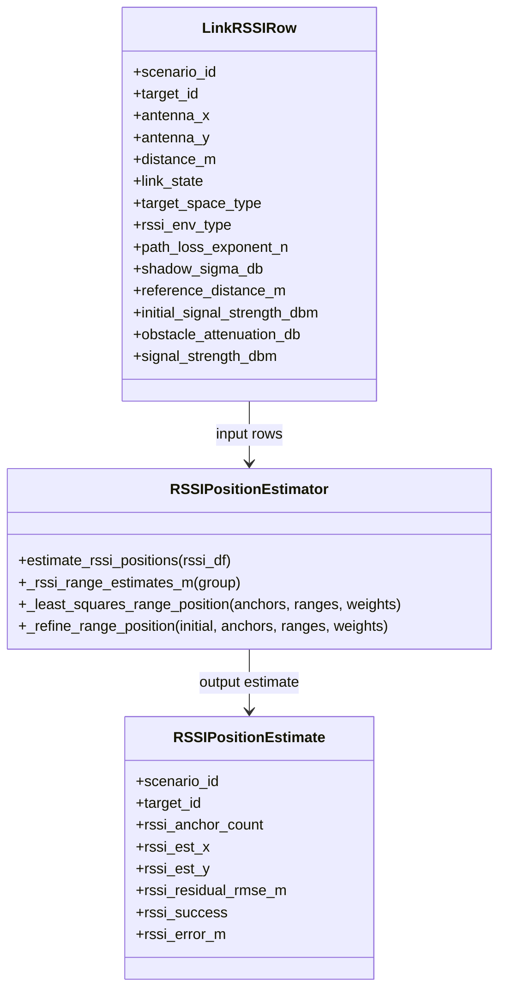

# Data generation

#### Overall specifications & constraints

The main purpose of this document is to define the specification and constraints for the RSSI data generation phase of a ***Machine Learning Device Positioning Prediction Model.***

We are emulating ***2D indoor and outdoor environments*** with multiple devices operating within a ***5 GHz frequency band***.

**Simplified data generation process:**
1. Define the scenario environment type (*indoor or outdoor*) using a random selection process. 
    - *This directly affects antenna-coverage generation. RSSI propagation class is derived from target location and per-link blockers, as described below.*
2. Generate necessary network characteristics to perform RSSI calculations based on the derived per-link RSSI environment class.
3. Return the generated data in a structured format for positioning estimation calculations.

 

### Environment

- **Dimensionality:**  
  The environment is modelled as a two-dimensional Cartesian coordinate space, with positions represented as $(x, y)$ coordinate pairs.

   

- **Restricted domain and range $(x, y)$:**  
  $-100 > x > 100,\ -100 > y > 100$  
  $-400 < x < 400,\ -400 < y < 400$  
  representing an indoor or outdoor environment of minimum **200 m × 200 m = 40,000 m²** and maximum **800 m × 800 m = 640,000 m²**.

   

- **Antenna positioning & density:**  
  Antennas are generated such that complete environment coverage is achieved with the minimum number of devices, ensuring uniform spatial distribution and no coverage gaps.

 

## RSSI Calculation

### Path Loss Exponent (Environment-Specific)

The path loss exponent $n$ characterises the average rate at which signal power decays with distance and depends on the propagation environment.

In the implementation, $n$ is sampled once per **scenario and derived RSSI environment class** and remains fixed for all links that share that class within the scenario.

The derived RSSI environment class is assigned as follows:

- If the target is in an outdoor area (`target_space_type == exterior` or `patio`), the link uses `outdoor` sigma values (1-2).
 

- If the target is in an indoor area (`target_space_type == room` or `building_free`) and `link_state == LOS`, the link uses `indoor_los` sigma values (2-4).
 

- If the target is in an indoor area (`target_space_type == room` or `building_free`) and `link_state == NLOS`, the link uses `indoor_nlos` sigma values (4-8).

`link_state` is computed geometrically per antenna-target link by checking whether the straight path intersects any wall or human obstacle.

We will only use outdoor, Indoor LOS and Indoor NLOS environment types. 

**Assumed values used in this project:**

| Environment Type | Description | Path Loss Exponent $n$ |
|------------------|------------|------------------------|
| Outdoor (Urban / Light Clutter) | Buildings, foliage | 2.7 – 3.5 |
| Indoor LOS | Open indoor areas (e.g. halls, warehouses) | 1.6 – 1.8 |
| Indoor NLOS | Multiple walls, partitions | 4.0 – 6.0 |

> **Reference:**  
> https://ieeexplore.ieee.org/document/5044933 

 

---

### Log-Distance Path Loss Model

The large-scale average path loss between two devices separated by distance $d$ is modelled using the **log-distance path loss model**:

$$
PL(d) = PL(d_0) + 10 n \log_{10}\!\left(\frac{d}{d_0}\right)
$$

where:
- $PL(d)$ is the path loss at distance $d$ (dB)
- $d_0$ is a reference distance (typically $1\,\text{m}$)
- $n$ is the path loss exponent
- $PL(d_0)$ is the free-space path loss at $d_0$

The free-space path loss at the reference distance is given by:

$$
PL(d_0) = 20 \log_{10}\!\left(\frac{4\pi d_0}{\lambda}\right)
$$

with wavelength:

$$
\lambda = \frac{c}{f}
$$

where $c$ is the speed of light and $f$ is the carrier frequency (5 GHz).

 

---

### Log-Normal Shadowing (Gaussian Noise)

To model environmental variability and measurement uncertainty, log-normal shadowing is applied by adding a **zero-mean Gaussian random variable** $X_\sigma$ in the logarithmic domain:

$$
PL(d) = PL(d_0) + 10 n \log_{10}\!\left(\frac{d}{d_0}\right) + X_\sigma
$$

where:

$$
X_\sigma \sim \mathcal{N}(0,\sigma^2)
$$

The parameter $\sigma$ represents the standard deviation of shadow fading (in dB) and is environment-dependent.

**Typical values used in this project:**

| Environment | $\sigma$ (dB) |
|------------|---------------|
| Free space / open outdoor | 5 – 7 |
| Indoor LOS | 8 – 10 |
| Indoor NLOS | 11 – 13 |
| Heavy obstruction | 14 – 15 |

> **References:**  
> 1) https://tetcos.com/documentation/v14.4/Propagation-Models/Shadowing%20models.html
> 2) https://en.wikipedia.org/wiki/Log-distance_path_loss_model 

The Gaussian noise term is applied independently to each wireless link, while $\sigma$ remains fixed per scenario and derived RSSI environment class.

 

---

### Estimating $n$ and $\sigma$ from Received-Power Samples (MMSE + SSE)

Assume $k$ received power measurements $\{p_i\}_{i=1}^{k}$ 

collected at distances $\{d_i\}_{i=1}^{k}$ from a transmitter, with reference distance $d_0$ and reference power $p(d_0)$.

 

#### 1) Log-distance received-power model

$$
\hat{p}_i = p(d_0) - 10n\log_{10}\!\left(\frac{d_i}{d_0}\right)
$$

#### 2) Sum of Squared Errors (SSE)

$$
J(n)=\sum_{i=1}^{k}\left(p_i-\hat{p}_i\right)^2
$$

#### 3) MMSE estimate of $n$

$$
\hat{n}=\arg\min_n J(n)
$$

#### 4) Estimating $\sigma$

$$
\sigma^2 = \frac{J(\hat{n})}{k}, \quad
\sigma = \sqrt{\frac{J(\hat{n})}{k}}
$$

 

---

### Using $\sigma$ During Data Generation

For each scenario:
1. Fit $\hat{n}$ using MMSE.
2. Compute $\sigma = \sqrt{J(\hat{n})/k}$.
3. For each wireless link $(i \rightarrow j)$, sample:

$$
X_{\sigma,i,j} = \sigma z,\quad z \sim \mathcal{N}(0,1)
$$

4. Compute received power:

$$
p_r(d) = p(d_0) - 10\hat{n}\log_{10}\!\left(\frac{d}{d_0}\right) + X_{\sigma,i,j}
$$

This ensures:
- $\sigma$ is **fixed per scenario and derived RSSI environment class**
- $X_{\sigma,i,j}$ is **independent per link**

 

### Calculating RSSI

$$
RSSI_{i,j} = P_t + G_{Tx} + G_{Rx} - PL_{i,j}
$$

where:
- $P_t$ is transmit power (dBm)
- $G_{Tx}$ and $G_{Rx}$ are antenna gains (dBi)
- $PL_{i,j}$ is the total path loss (dB)

 

---

### RSSI Position Estimation

`position_estimation.py` first converts each RSSI measurement into an estimated range, then solves a weighted multilateration problem.

 

#### 1) Convert RSSI to range

For link $(i,j)$, the code computes the measured excess loss relative to the reference distance as:

$$
\Delta PL_{i,j} = P_r(d_0) - RSSI_{i,j}
$$

If obstacle attenuation is present in the table, it is compensated before inversion:

$$
\Delta PL^{\text{comp}}_{i,j} = \Delta PL_{i,j} - L^{\text{obs}}_{i,j}
$$

The estimated range is then:

$$
\hat{d}_{i,j} = d_0 \, 10^{\frac{\Delta PL^{\text{comp}}_{i,j}}{10 n_{i,j}}}
$$

where:
- $P_r(d_0)$ is the reference RSSI at distance $d_0$ (`initial_signal_strength_dbm`)
- $L^{\text{obs}}_{i,j}$ is optional obstacle attenuation (`obstacle_attenuation_db`)
- $n_{i,j}$ is the path loss exponent for that link

 

#### 2) Estimate position by weighted least-squares multilateration

Let antenna positions be $\mathbf{a}_k = (x_k, y_k)$ and estimated ranges be $\hat{d}_k$.

The implementation chooses the reference antenna $r$ as the one with the smallest estimated range and solves the linearized system:

$$
2(\mathbf{a}_k - \mathbf{a}_r)^\top \hat{\mathbf{p}} = \hat{d}_r^2 - \hat{d}_k^2 + \|\mathbf{a}_k\|^2 - \|\mathbf{a}_r\|^2, \qquad k \neq r
$$

where $\hat{\mathbf{p}} = (\hat{x}, \hat{y})$ is the estimated target position.

Each equation is weighted using the inverse shadow-fading variance:

$$
w_k = \frac{1}{\sigma_k^2}
$$

with $\sigma_k$ taken from `shadow_sigma_db`.

After the linear solve, the code refines the estimate by minimizing the weighted nonlinear range residual:

$$
\hat{\mathbf{p}} = \arg\min_{\mathbf{p}} \sum_k w_k \left(\|\mathbf{p} - \mathbf{a}_k\| - \hat{d}_k\right)^2
$$

This is the RSSI positioning method implemented in `position_estimation.py`.

#### UML Diagram

