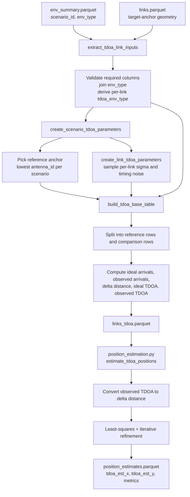

# Data generation

#### Overall specifications & constraints

The main purpose of this document is to define the specification and constraints for TDOA the data generation phase of a ***Machine Learning Device Positioning Prediction Model.***

We are emulating ***2D indoor and outdoor environments*** with multiple devices operating within a ***5 GHz frequency band***.

<br>

### Environment

- **Dimensionality:**  
  The environment is modelled as a two-dimensional Cartesian coordinate space, with positions represented as $(x, y)$ coordinate pairs.

  <br>

- **Restricted domain and range $(x, y)$:**  
  $-100 > x > 100,\ -100 > y > 100$  
  $-400 < x < 400,\ -400 < y < 400$  
  representing an indoor or outdoor environment of minimum **200 m × 200 m = 40,000 m²** and maximum **800 m × 800 m = 640,000 m²**.

  <br>

- **Antenna positioning & density:**  
  Antennas are generated such that complete environment coverage is achieved with the minimum number of devices, ensuring uniform spatial distribution and no coverage gaps.

<br>

---

### Time Difference of Arrival (TDOA)


#### Purpose

`TDOA_envs.py` builds a TDOA measurement table from the shared geometry table in `links.parquet`.

It does not estimate a target position directly.

Its output is:

- `links_tdoa.parquet`

Each row in `links_tdoa.parquet` is one TDOA measurement for:

- one `scenario_id`
- one `target_id`
- one non-reference anchor, measured relative to a fixed reference anchor in that scenario

#### Input Tables

`TDOA_envs.py` reads:

- `env_summary.parquet`
- `links.parquet`

Required columns from `links.parquet`:

- `scenario_id`
- `target_id`
- `target_label`
- `target_x`
- `target_y`
- `antenna_id`
- `antenna_label`
- `antenna_x`
- `antenna_y`
- `distance_m`
- `link_state`
- `target_space_type`

Required columns from `env_summary.parquet`:

- `scenario_id`
- `env_type`

Supported scenario environment types:

- `outdoor`
- `indoor`

## What The Script Generates

For each scenario:

1. `env_type` is joined from `env_summary.parquet` onto each row in `links.parquet`.
2. A single reference anchor is selected.
   The code uses the lowest `antenna_id` in the scenario as `reference_antenna_id`.
3. Each antenna-target link is assigned a derived TDOA environment class:
   - `outdoor` for `target_space_type` in `exterior` or `patio`
   - `indoor_los` for targets inside the floor-map area with `link_state == LOS`
   - `indoor_nlos` for targets inside the floor-map area with `link_state == NLOS`
4. A timing-noise sigma and a timing-noise sample are drawn once per original link.
5. Every non-reference anchor becomes a comparison anchor.
6. For each target and comparison anchor, the script computes:
   - reference distance and arrival time
   - comparison distance and arrival time
   - reference-link timing noise
   - comparison-link timing noise
   - ideal TDOA
   - TDOA noise as the difference between the two link noises
   - observed TDOA
   - delta distance

The output granularity is therefore:

- one row per `(scenario_id, target_id, comparison_antenna_id)`

## Noise Model

The TDOA timing-noise sigma is sampled once per link from a uniform range that depends on the derived `tdoa_env_type`:

- outdoor: `0.05 ns` to `0.20 ns`
- indoor LOS: `0.10 ns` to `0.30 ns`
- indoor NLOS: `0.30 ns` to `0.50 ns`

The derived TDOA environment class is:

- `outdoor` when `target_space_type` is `exterior`, `patio`, or `outdoor`
- `indoor_los` when `target_space_type` is `room`, `building_free`, or `indoor` and `link_state == LOS`
- `indoor_nlos` when `target_space_type` is `room`, `building_free`, or `indoor` and `link_state == NLOS`

Formula:

$$
\sigma_{0} \sim \mathcal{U}(\sigma_{\min,0}, \sigma_{\max,0})
$$

$$
\sigma_{i} \sim \mathcal{U}(\sigma_{\min,i}, \sigma_{\max,i})
$$

Then each original antenna-target link samples one Gaussian timing perturbation:

$$
\epsilon_{0} \sim \mathcal{N}(0, \sigma_0^2)
$$

$$
\epsilon_i \sim \mathcal{N}(0, \sigma_i^2)
$$

## TDOA Generation Formulas

Let:

- target position be $P = (x_T, y_T)$
- reference anchor be $A_0 = (x_0, y_0)$
- comparison anchor be $A_i = (x_i, y_i)$
- propagation speed be $c$

Distances:

$$
d_0 = \|P - A_0\|
$$

$$
d_i = \|P - A_i\|
$$

Ideal arrival times in nanoseconds:

$$
t_0 = \frac{d_0}{c} \cdot 10^9
$$

$$
t_i = \frac{d_i}{c} \cdot 10^9
$$

Observed arrival times in nanoseconds:

$$
t_0^{\text{obs}} = t_0 + \epsilon_0
$$

$$
t_i^{\text{obs}} = t_i + \epsilon_i
$$

Distance difference:

$$
\Delta d_i = d_i - d_0
$$

Ideal TDOA in nanoseconds:

$$
\Delta t_i^{\text{ideal}} = \frac{\Delta d_i}{c} \cdot 10^9
$$

TDOA noise in nanoseconds:

$$
\eta_i = \epsilon_i - \epsilon_0
$$

The code also reports the equivalent TDOA noise sigma:

$$
\sigma_{\Delta t_i} = \sqrt{\sigma_0^2 + \sigma_i^2}
$$

Observed TDOA in nanoseconds:

$$
\Delta t_i^{\text{obs}} = t_i^{\text{obs}} - t_0^{\text{obs}} = \Delta t_i^{\text{ideal}} + \eta_i
$$

This matches the code columns:

- `reference_arrival_time_ns`
- `comparison_arrival_time_ns`
- `reference_observed_arrival_time_ns`
- `comparison_observed_arrival_time_ns`
- `delta_distance_m`
- `ideal_tdoa_ns`
- `reference_timing_noise_ns`
- `comparison_timing_noise_ns`
- `tdoa_noise_sigma_ns`
- `tdoa_noise_ns`
- `observed_tdoa_ns`

## Output Table: `links_tdoa.parquet`

Each row contains:

### Target identity and ground truth

- `scenario_id`
- `target_id`
- `target_label`
- `target_x`
- `target_y`

### Reference anchor

- `reference_antenna_id`
- `reference_antenna_label`
- `reference_antenna_x`
- `reference_antenna_y`
- `reference_distance_m`
- `reference_link_state`
- `reference_tdoa_env_type`
- `reference_timing_noise_sigma_ns`
- `reference_timing_noise_ns`

### Comparison anchor

- `comparison_antenna_id`
- `comparison_antenna_label`
- `comparison_antenna_x`
- `comparison_antenna_y`
- `comparison_distance_m`
- `comparison_link_state`
- `comparison_tdoa_env_type`
- `comparison_timing_noise_sigma_ns`
- `comparison_timing_noise_ns`

### Shared TDOA parameters

- `propagation_speed_m_per_s`
- `tdoa_noise_sigma_ns`

### Computed TDOA quantities

- `reference_arrival_time_ns`
- `comparison_arrival_time_ns`
- `reference_observed_arrival_time_ns`
- `comparison_observed_arrival_time_ns`
- `ideal_tdoa_ns`
- `tdoa_noise_ns`
- `observed_tdoa_ns`
- `delta_distance_m`

## Validation Rules Implemented In `TDOA_envs.py`

The script raises an error if:

- `propagation_speed_m_per_s <= 0`
- any TDOA noise bound is invalid
- `links.parquet` is missing required columns
- a link row does not map to a scenario `env_type`
- any `distance_m < 0`
- duplicate `(scenario_id, target_id, antenna_id)` rows exist
- a scenario has fewer than 2 antennas
- a scenario-target pair does not contain one link for every scenario antenna
- duplicate reference links exist for a scenario-target pair
- no non-reference anchors are available
- a comparison row cannot find its reference-anchor row

## Data Flow UML



## How `position_estimation.py` Uses The TDOA Table

`position_estimation.py` groups `links_tdoa.parquet` by:

- `scenario_id`
- `target_id`

For each group it:

1. Reads the single reference anchor position from the first row.
2. Reads all comparison anchor positions.
3. Converts `observed_tdoa_ns` into distance differences.
4. Solves for a 2D point estimate of the target position.

## TDOA Position-Estimation Formulas

### 1) Convert observed TDOA to observed delta distance

The code converts each observed time difference into a range-difference measurement:

$$
\Delta \hat{d}_i = \Delta t_i^{\text{obs}} \cdot \frac{c}{10^9}
$$

where:

- $\Delta t_i^{\text{obs}}$ is `observed_tdoa_ns`
- $c$ is `propagation_speed_m_per_s`

### 2) Initial least-squares system

Let the unknown target position be:

$$
\hat{\mathbf{p}} = (\hat{x}, \hat{y})
$$

and let the reference-anchor distance be an auxiliary unknown:

$$
r_0 = \|\hat{\mathbf{p}} - \mathbf{a}_0\|
$$

The code builds the linearized system:

$$
2(x_0 - x_i)\hat{x} + 2(y_0 - y_i)\hat{y} - 2\Delta \hat{d}_i r_0 = (\Delta \hat{d}_i)^2 - x_i^2 + x_0^2 - y_i^2 + y_0^2
$$

for each comparison anchor $\mathbf{a}_i = (x_i, y_i)$ relative to reference anchor $\mathbf{a}_0 = (x_0, y_0)$.

This is solved with ordinary least squares to obtain an initial estimate.

### 3) Nonlinear refinement

The initial estimate is refined iteratively using the TDOA residual model:

$$
r_i(\hat{\mathbf{p}}) = \|\hat{\mathbf{p}} - \mathbf{a}_i\| - \|\hat{\mathbf{p}} - \mathbf{a}_0\| - \Delta \hat{d}_i
$$

The Jacobian row used by the code is:

$$
\frac{\partial r_i}{\partial \hat{\mathbf{p}}} = \frac{\hat{\mathbf{p}} - \mathbf{a}_i}{\|\hat{\mathbf{p}} - \mathbf{a}_i\|} - \frac{\hat{\mathbf{p}} - \mathbf{a}_0}{\|\hat{\mathbf{p}} - \mathbf{a}_0\|}
$$

At each iteration, the solver computes a least-squares update:

$$
J \, \delta = -r
$$

and updates the estimate:

$$
\hat{\mathbf{p}} \leftarrow \hat{\mathbf{p}} + \delta
$$

The loop stops when the step norm becomes very small or the iteration limit is reached.

### 4) Residual RMSE reported by the code

After solving, the script reports:

$$
\text{RMSE} = \sqrt{\frac{1}{N}\sum_{i=1}^{N}\left(\|\hat{\mathbf{p}} - \mathbf{a}_i\| - \|\hat{\mathbf{p}} - \mathbf{a}_0\| - \Delta \hat{d}_i\right)^2}
$$

This is stored as:

- `tdoa_residual_rmse_m`

## What The TDOA Output Represents

There are two different outputs in the pipeline:

### 1) `links_tdoa.parquet`

This is a measurement table.

It contains:

- timing differences
- geometry
- per-link timing-noise settings
- per-link TDOA environment classes

It is not a position estimate.

### 2) `position_estimates.parquet`

This is the downstream estimation table produced by `position_estimation.py`.

For TDOA, the output is a single 2D coordinate estimate:

- `tdoa_est_x`
- `tdoa_est_y`

So the TDOA estimator output is:

- a point in 2D Cartesian space

It is not:

- an area
- a confidence region
- a polygon
- a probability heatmap

The current implementation does not output an uncertainty area. It only outputs a point estimate and quality metrics:

- `tdoa_error_m`
- `tdoa_residual_rmse_m`
- `tdoa_anchor_count`
- `tdoa_success`

## Minimum Anchor Requirement For A TDOA Position Estimate

`TDOA_envs.py` can generate rows when a scenario has at least 2 antennas.

However, `position_estimation.py` requires at least 3 comparison anchors, which means at least 4 anchors total:

- 1 reference anchor
- 3 comparison anchors

If fewer than 4 anchors are available, the TDOA position estimate returns:

- `tdoa_success = False`
- `tdoa_est_x = NaN`
- `tdoa_est_y = NaN`

## CLI Usage

Examples:

```bash
python3 "Data Generation/TDOA/TDOA_envs.py" --data-dir "generated_network_scenarios"
python3 "Data Generation/TDOA/TDOA_envs.py" --data-dir "generated_network_scenarios" --seed 42
python3 "Data Generation/TDOA/TDOA_envs.py" \
  --data-dir "Data Generation/generated_network_scenarios" \
  --propagation-speed-m-per-s 299792458.0
python3 "Data Generation/TDOA/TDOA_envs.py" \
  --data-dir "Data Generation/generated_network_scenarios" \
  --seed 7
```

Relevant arguments:

- `--data-dir`
- `--seed`
- `--propagation-speed-m-per-s`
- `--outdoor-noise-sigma-ns-min`
- `--outdoor-noise-sigma-ns-max`
- `--indoor-los-noise-sigma-ns-min`
- `--indoor-los-noise-sigma-ns-max`
- `--indoor-nlos-noise-sigma-ns-min`
- `--indoor-nlos-noise-sigma-ns-max`
- `--indoor-noise-sigma-ns-min`
- `--indoor-noise-sigma-ns-max`
- `--output`
- `--overwrite-links`
